# LOWTECH FLEX SENSOR
## 2025-2026-4GP-KONIG-EVENSEN

This work is regulated by the Creative Commons Licence CC BY 4.0, for more information 
[follow this link](https://creativecommons.org/licenses/by/4.0/).

BILDE AV 3D MODELL!!!!!!!!!!!!!!!!!!!!!!!!!!!!!!!!!!!!!!!!!!!

---

## Introduction
During this project we have sought out to create a LowTech Flex Sensor based on the conduction properties of graphite. LowTech projects consists of developping technological solutions while respecting sobriety, efficiency, durability, maintainability, accessibility, autonomization, empowerment, connectedness and simplification. Hence, it promotes technology which is sustainable both environmentally and socially, as well as uncomplicated and accessible. The following sections will describe the different procedures of the development of the sensor, as well as an evaluation of the performance of the sensor. 

- [The Physics Behind the Graphite Sensor](#the-physics-behind-the-graphite-sensor)
- [Procedure](#procedure)
- [Amplificator Circuit Simulations](#amplificator-circuit-simulations)
- [Printed Circuit Board Design and Development](#printed-circuit-board-design-and-development)
- [Arduino Code](#arduino-code)
- [APK Application Design and Development](#apk-application-design-and-development)
- [Test Setup](#test-setup)
- [Conclusion](#conclusion)

---

## The Physics Behind the Graphite Sensor
This project is based on the research of [Lin et al.](https://www.nature.com/articles/srep03812) on the use of "Pencil Drawn Strain Gauges and Chemiresistors on Paper". They showed that regular commercial pencils deposit fine graphite particles on paper during dry application due to friction. The graphite powder makes up a percolated network which works as a thin conductive film on the paper. This makes for an increadibly easy deposit method for generating conductive films in various patterns.
By creating a specific U-shaped pencil trace (see [Datasheet](./GraphiteSensor_Datasheet/Datasheet_Graphite_Flex_Sensor.pdf)), the conductive properties of the graphite network can be used to measure compressive and tensile deflections, and we can therefore employ it as a strain gauge. When the graphite is in compression (inward deflection), the graphite particle network is compressed, creating a more closely connected conductive film, and hence lowering the resistance of the strain gauge. Contrarily, tension (outward deflection) increases the resistance of the strain gauge as the distances between the graphite particles increase and disconnects the conduction pathways. The conduction between non-connected graphite particles remains possible due to tunneling effect in granular systems.

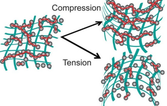

The resistance of the pencil trace can easily be measured, and varies based on the type of pencil used (in this project HB, 3B and 6B). Softer pencils have higher graphite content and therefore show lower resistance.

The application of this principle allows for the production of low-cost, environmentally-friendly and uncomplicated paper-based electronics.

## Procedure
For this project we started off with the perception of an amplification circuit based on an operational amplifier of the type LTC1050 for the amplification of the signal from the graphite sensor. Secondly, we designed and developed a printed circuit board for the implementation of the amplification circuit (employing a digital potentiometer of the type MCP41010), an OLED screen, a rotary encoder, a bluetooth module of the type HC-05 and a commercial flex sensor. All datasheets for the commercial components can be found in the repository [Components_Datasheets](./Components_Datasheets/). The printed circuit board was designed as a shield for an Arduino UNO. Thereafter, we wrote an Arduino IDE script implementing all the components and facilitating the measuring and testing of the graphite flex sensor. Later we designed and developed an APK Application for Android using MIT App Inventor, which allows communication with the Arduino using the bluetooth module. Finally, we developed a test setup for the quantitative analyzis of the graphite sensors development. All parts of the procedure are further developed in the following part.

## Amplificator Circuit Simulations
Before the conception of the circuit for the realization of the graphite sensor, we performed simulations of the amplifier circuit in order to predict its performance. For this simulation we used the program LTSpice, and the exact files used can be found in the repository [LTSpice_Files](./LTSpice_Files/). The amplifier circuit tested was as follows:

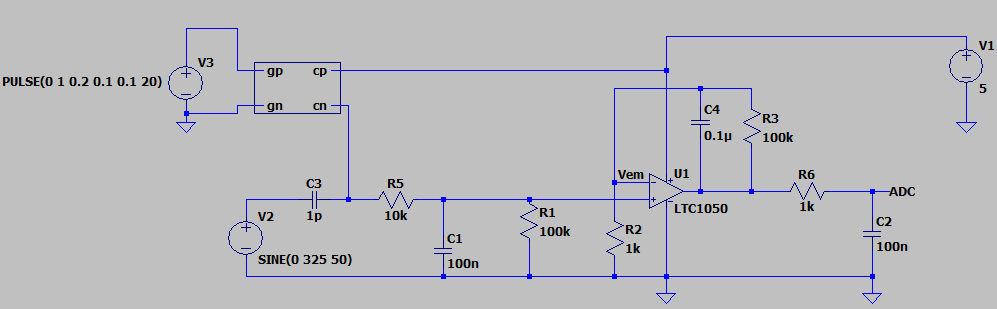

The graphite sensor is simulated by the following circuit:

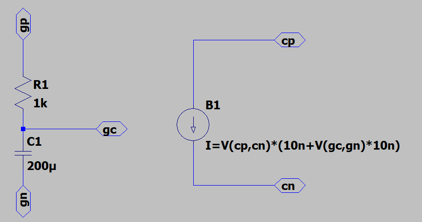

As the graphite sensor constitutes a very sensitive system, it is extremeley susceptible to noise at 50Hz coming from the capacitive coupling to the grid power at 230V, as shown by the Fourier transform of the acquired signal.

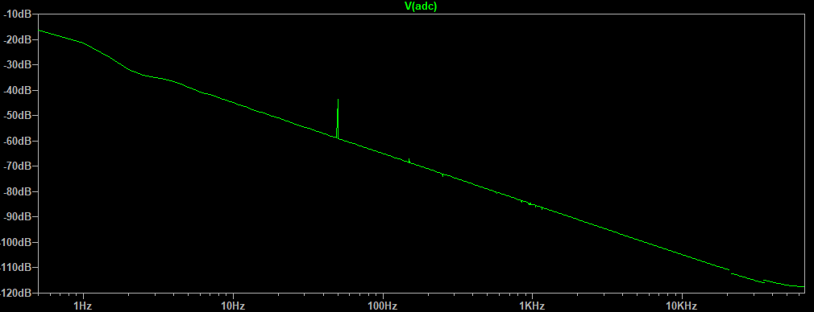

The amplifier circuit serves as a low-pass filter with a cutoff frequency at approximately 1.6Hz to reduce the influence of this noise. It also serves to minimize the noise from the other componenets which will be added to the printed circuit board, such as the clock of the digital circuits and the radio frequency used for the bluetooth communication. The circuit consists of a passive filter which minimizes high frequency noise, an active filter of the type LTC1050, and a second passive filter for filtering out the noise coming from the processing of the signal.

During the testing of the ciruit's transient response, the dependency on the capacitance C4 became evident. An increased value of the capacitance minimized the influence of noise on the signal, but increased the repsonse time significantly. Contrarily, a decreased value enhanced the response time, but augmented the noise influence. A compromise between the two conflicting properties was made when determining the value of the capacitance.

C4 = 0.1 $\mu$ F
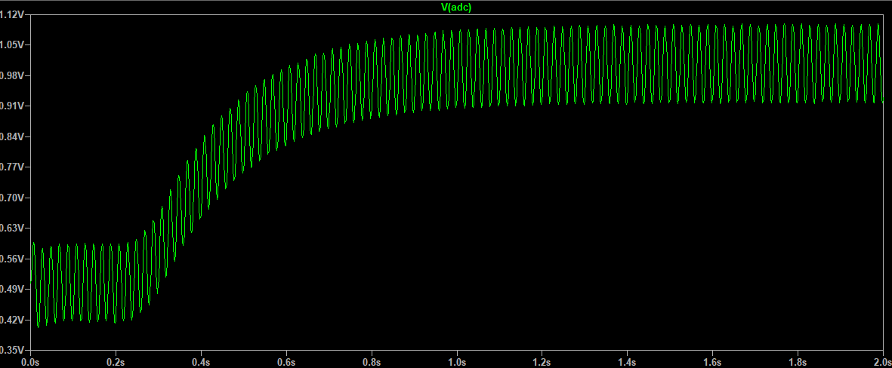

C4 = 1 $\mu$ F
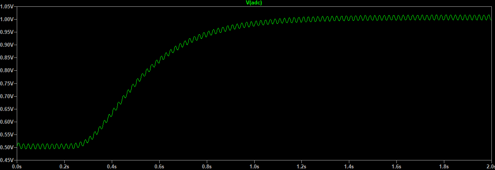

C4 = 0.1 $\mu$ F
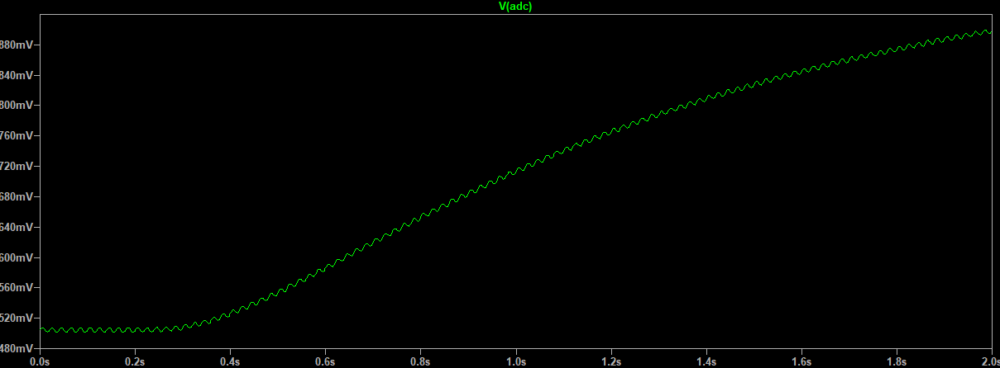

## Printed Circuit Board Design and Development
The design of the printed circuit board (PCB) destined for the use as a shield for an Arduino UNO was done using the program KiCad. Here, diagrams and imprints were made of all the necessary components, and the PCB was designed with the necessary connections between the components and the Arduino UNO. The PCB allows the connection between the Arduino UNO and the following components ([link to datasheets](./Components_Datasheets/)).

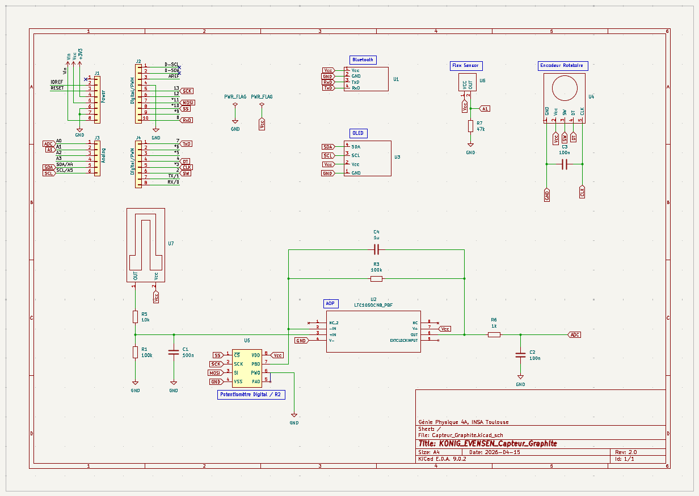

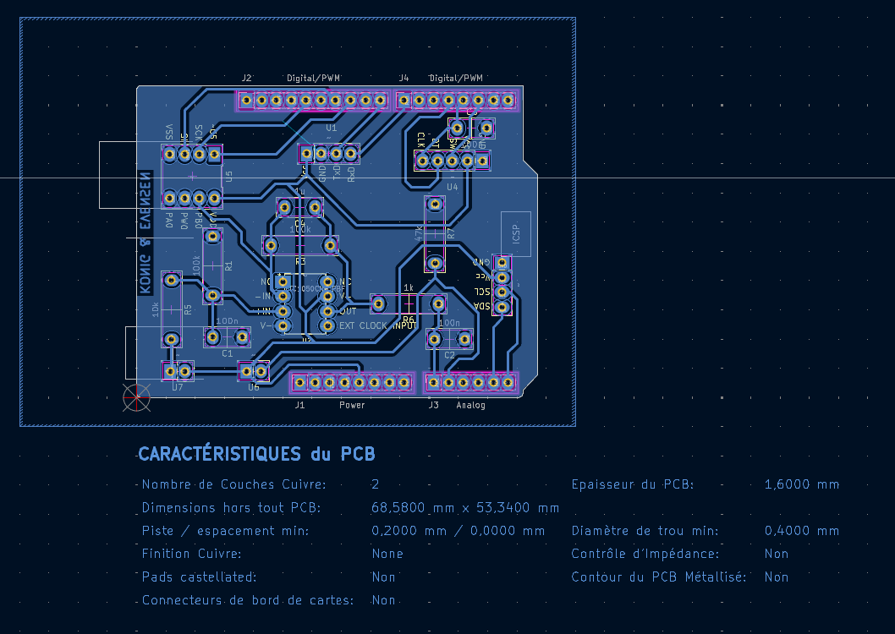

### Graphite Sensor
The signal of the graphite sensor is connected to the Arduino UNO through the amplifier circuit based on the operational amplifier LTC1050. The digital potentiometer MCP41010 takes part of this circuit and is used to regulate the signal Vadc following this formula:

> $R_C = (V_C/V_A)*R_1*(1+R_3/R_P)-R_1-R_5$

Where Rc is the resistance of the graphite sensor, Va is the voltage of the output of the amplifier circuit and Rp is the resistance of the digital potentiometer.

The voltage output from the amplifier circuit can be retreived on the analog pin A0.

### Commercial Flex Sensor
The commercial flex sensor is connected using a resistance of 47kOhms in a voltage divider circuit. The resistance of the flex sensor can be retreived on the analog pin A1.

### OLED Screen
The OLED Screen used is of the type SBC-OLED01 and uses the SCL (serial clock line) and SDA (serial data line) pins common for the I2C serial communication bus. I2C has a 7-bit address space and transfers data bit by bit between the controller and the target. The SDA and SCL pins correspond to the pin A4 and A5, respectively, on th Arduino UNO.

### Rotary Encoder
A rotary encoder of the type KY-040 is connected using the CLK, DT and SW pins. The SW (switch) and CLK (clock) are connected to respectively the pins D2 and D3 of the Arduino UNO as these permit the use of interruptions, as is generated on CLK when rotating the rotary encoder. The DT (data) pin connects to D4.
Inside the rotary encoder, two switches serve to determine a rotation as they are either both opened or closed in each encoder position. The order in which the swithces change state is used to determine the direction of the rotation, as shown by the diagram below:

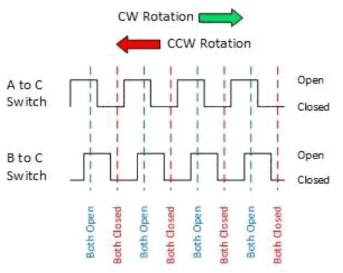

A capacitor is connected between the ground and the CLK pin in order to stabilize the interrupt signal.

### Bluetooth Module
Bluetooth permits wireless communication between devices, and in this project a bluetooth module of the type HC-05 is used to establish communication between the Arduino UNO and other devices. It communicates using radio frequencies around 2.4GHz, which is the same as mobile phones and Wi-Fi. This module provides serial communication over the TxD (transmission) and RxD (receiving) pins, connected to the TxD (7) and RxD pins (8) of the Arduino UNO. 

### Printed Circuit Board Develeopment
For the development of the PCB a PDF-file of the PCB design was printed on transparent paper and used as a mask during UV-exposure of a laminate board covered by a thin layer of copper and photo resist. The exposed photo resist is removed using an alkaline solution, and a copper solvent solution bath removes the uncovered copper. Lastly, the hardened photo resist is removed and only the wanted copper traces on the laminate board are left.

Afterwards, holes are drilled and passive components, as well as supports for the active components, are welded to the printed circuit board.

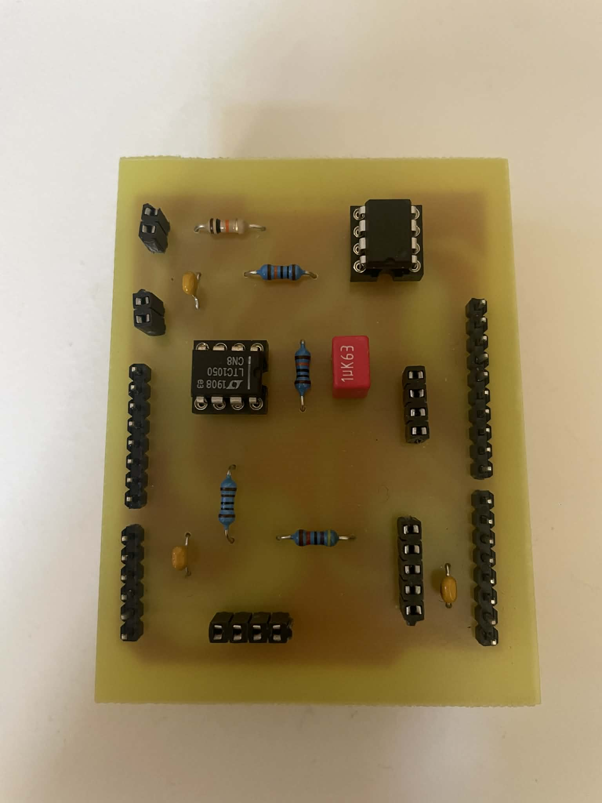

## Arduino Code
After the conception of the PCB, we continued to the development of an Arduino IDE code permitting the controlling of the components. The Ardunio code has multiple functionalities interconnecting the electrical components.

The use of the rotary encoder controls a menu on the OLED screen. The menu includes three different modes: "Flex", "Graphite" and "GitHub QR". Clicking the rotary encoder accesses the different modes, and clicking it again returns to the main menu.

**Flex:** 
The Flex mode permits the monitoring of the commercial flex sensor, printing the resistance and the corresponding angle to the serial monitor of Arduino IDE.

**Graphite:**
The Graphite mode permits the monitoring of the LowTech graphite sensor. The first time the graphite mode is activated, a calibration of the digital potentiometer is started, changing its resistance value in order to get a Vadc corresponding to approximately 2.5V (512 bits). When ajusted, the graphite mode prints the resistance of the graphite sensor to the serial monitor of Arduino IDE.

**GitHub QR:**
The GitHub QR mode displays a QR code which links to the GitHub page of this project.

The Arduino code also manages the serial communication over Bluetooth which is used for the transfer of data between the Arduino UNO and an android when using the APK Application which will be described in the following section.

## APK Application Design and Development
An APK Application for Android has been developed using the program MIT App Inventor. This application can easily be downloaded to any android device and permits a simple monitoring of the Arduino UNO. The application allows for connecting to a bluetooth module such as the HC-05. Depending on if the Flex mode or the Graphite mode is activated, the graphs in the application display the current measured resistance and the relative resistance when "Start" is clicked. When "Stop" is clicked the measurement will stop, and if "Start" is then reclicked, the graphs reset and a new measurement start. The results of a measurement can be shared or saved using the "Share Result" button. It will then be shared as a text file with the format "x1,y1;x2,y2;...". A "Scan Barcode" button permits the scanning of QR codes, such as the one displayed in QR mode, leading directly to the GitHub page of this project.

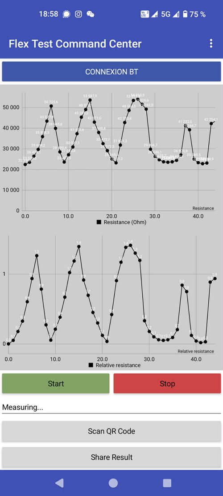 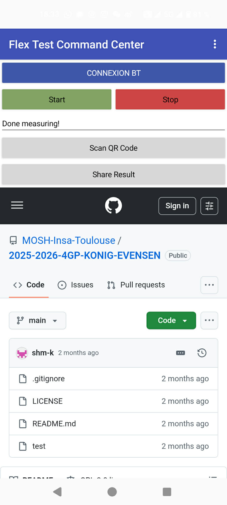

## Test Setup
For the testing of the performance of the LowTech graphite sensor, we developed a simple test setup based on the principle of a three-point flexural test. We designed a 3D model using TinkerCad and printed it with the help of extremely knowledgeable and helpful representatives of the INSA Toulouse FabLab Fabric'INSA. The STL-files can be found in the repository [TestSetup_Files](./TestSetup_Files/Projet_MOSH.stl).

The test setup enables both tension and compression tests, and can be used for both the commercial flex sensor and the LowTech graphite sensor at the same time. The absolute value of the strain is calculated using the following formula:

> $$\epsilon = 6Dd/L^2$$

where D(mm) is the maximum deflection of the middle of the graphite sensor, d(mm) is the thickness of the paper, and L(mm) is the length between the two supports of the test module.

## Conclusion
In order to conclude on the results of this project, we have analyzed the performance of the LowTech graphite sensor compared to a commercial flex sensor.

However, the reproductablity of the graphite sensor is questionable. The results from the tests show little to no predictability of the results with extreme uncertainty in the resistance response to the application of both tension and compression to the graphite sensor.

ABSOLUTT IKKE FERDIG!!!!!!!!!!!!!!!!!!

---

Created by Svea KONIG and Maia EVENSEN (4GP INSA Toulouse)

For support, contact konig@insa-toulouse.fr or evensen@insa-toulouse.fr